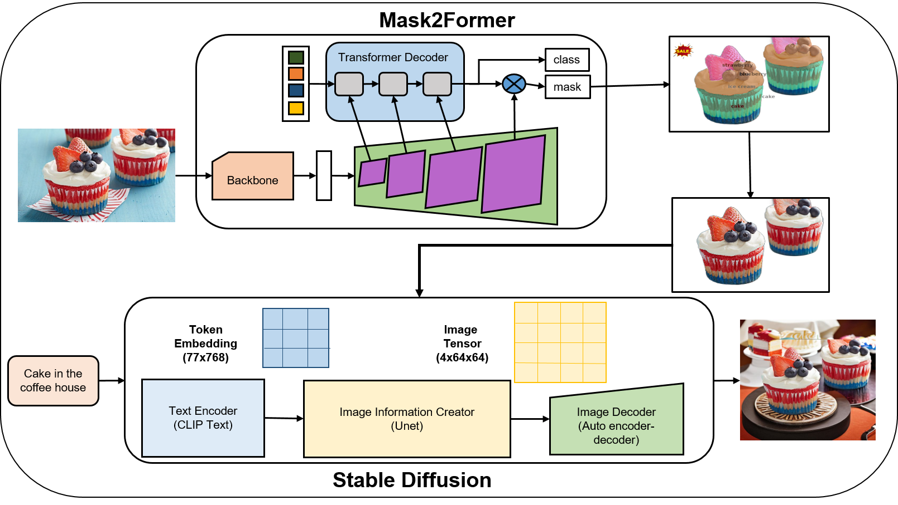

# AI_project_1

# 🍽️ AI Image Editing Solution for Restaurant Marketing

This project provides an **AI-powered image editing pipeline** tailored for **restaurant marketing**, enabling automatic food segmentation and background replacement to generate visually appealing images for menus, websites, and promotions.

---

## 🔍 Overview

The pipeline consists of:
- **Food segmentation** using `Mask2Former` trained on the `FoodSeg103` dataset.
- **Background removal and replacement** using `Stable Diffusion` to generate clean or styled backgrounds.
- Aimed at restaurants needing fast, consistent, and beautiful visuals without manual photo editing.

---

## 📂 Dataset: FoodSeg103

- **Source:** [https://github.com/LZU-TI/FoodSeg103](https://github.com/LZU-TI/FoodSeg103)
- **Content:** 103 categories of annotated food images with pixel-wise segmentation masks.
- **Usage:** Training semantic/instance segmentation models to detect food regions.

---
## 🧠 My Framework




## 🧠 Model Pipeline

### 🟣 1. Segmentation – Mask2Former

- **Model:** Mask2Former (by Meta AI)
- **Backbone:** Swin Transformer / ResNet
- **Task:** Semantic segmentation on food images
- **Input:** RGB image of a dish
- **Output:** Segmentation mask highlighting food items

**Example training:**
```bash
python train_net.py \
  --config-file configs/foodseg103/mask2former_R50.yaml \
  --num-gpus 2
```

🎨 2. Background Generation – Stable Diffusion
Model: Stable Diffusion Inpainting

Framework: 🤗 HuggingFace diffusers or CompVis implementation

Input: Masked food image + text prompt

Output: AI-generated background (styled or realistic)
```bash
from diffusers import StableDiffusionInpaintPipeline
import torch
from PIL import Image

pipe = StableDiffusionInpaintPipeline.from_pretrained(
    "runwayml/stable-diffusion-inpainting"
).to("cuda")

result = pipe(
    prompt="minimalist marble table background",
    image=original_image,
    mask_image=mask_image
).images[0]
```
⚙️ How It Works
📸 Upload or load a food image.

🧠 Segment food region using Mask2Former.

✂️ Remove the background using the generated mask.

🖼️ Generate a new background using Stable Diffusion with desired prompt.

🧩 Composite the food and background into a final image.


# Clone project
git clone https://github.com/yourusername/ai-restaurant-image-editing.git
cd ai-restaurant-image-editing

# Install dependencies
pip install -r requirements.txt

